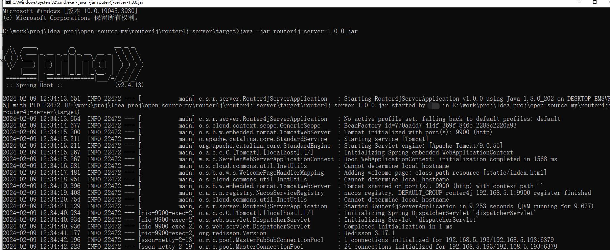
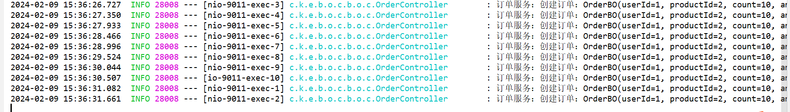
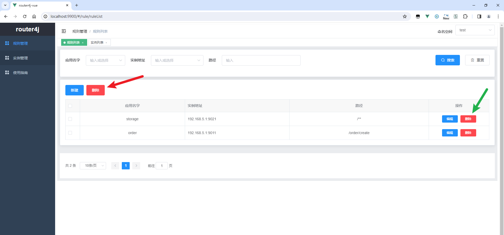

​

#  前言

本文介绍Java的动态路由中间件：router4j。router4j用于SpringCloud项目，它可以将某个url请求路由到指定的机器上，也可以将所有请求强制转到指定机器。

**问题描述**

Java后端在开发SpringCloud项目时如果同一个应用起了多个实例，会遇到以下问题：

1.  无法将指定url请求强制转到个人电脑。这样会导致难以打断点调试；如果是设置了应用的所有请求都到我的电脑，那么我在调试时其他接口无法使用。
1.  无法将指定的feign的url请求强制转到个人电脑。
1.  如果有人打了断点调试，很可能影响测试环境，因为网关的请求和feign请求还是会经常请求到打了断点的那个电脑。

本文的router4j可以解决这个问题：它可以设置将指定的url的请求路由到指定的机器。

**官网网址**

官网文档：

github：[https://github.com/knife-blade/router4j](https://github.com/knife-blade/router4j "https://github.com/knife-blade/router4j")

gitee：[https://gitee.com/knifeedge/router4j](https://gitee.com/knifeedge/router4j "https://gitee.com/knifeedge/router4j")

# 一、简介

## 1.1 概述

router4j是一个动态路由的中间件，用于提高Java后端开发和调试效率。

使用router4j，可以将某个url请求路由到指定的机器上，只需在可视化页面上将path绑定到应用实例的ip和端口上即可。

router4j也支持将所有请求强制转到指定机器，所以也可以用于线上不停机更新应用。

## 1.2 特性

-   **简单**：支持通过Web页面操作，操作简单，一分钟上手；
-   **无侵入**：引入依赖即可，无需修改代码
-   **性能损耗小**：路径的规则存放在Redis，速度很快，几乎没有性能损耗
-   **支持路径的路由**：可以指定某个url路由到指定机器
-   **支持默认路由**：如果url没有设置规则，则转发到设置的默认路由的实例
-   **支持强制路由**：所有url强制路由到指定实例（无论是否设置了规则）
-   **支持网关**：支持网关的请求转发
-   **支持feign**：支持feign的请求转发
-   **支持实例运行状态查看**：支持查看实例的运行状态

## 1.3 支持的框架

-   网关

	-   gateway（已支持，已测试）
	-   zuul（待支持）

-   SpringCloud

	-   loadbalancer（已支持，已测试）（SpringCloud2020及之后的版本）
	-   ribbon（待支持）

-   注册中心

	-   Nacos（已支持，已测试）
	-   Eureka（已支持，未测试）

## 1.4 框架结构

1.在可视化页面进行配置，将url与实例（ip加端口）关联起来

2.前端请求进来时：gateway会使用本框架的全局过滤器，会根据这个url到Redis中的配置中查询，将url路由到指定的实例（ip加端口）

3.调用feign时：feign会使用本框架的负载均衡器，会根据这个url到Redis中的配置中查询，将url路由到指定的实例（ip加端口）

## 1.5 下载

github：[https://github.com/knife-blade/router4j](https://github.com/knife-blade/router4j "https://github.com/knife-blade/router4j")

gitee：[https://gitee.com/knifeedge/router4j](https://gitee.com/knifeedge/router4j "https://gitee.com/knifeedge/router4j")

# 二、快速入门

## 2.1 添加依赖

备注：本文依赖已上传到maven中央仓库、maven阿里云镜像。

**gateway网关和应用都添加依赖**

```
<dependency>
    <groupId>com.suchtool</groupId>
    <artifactId>router4j-client-spring-boot-starter</artifactId>
    <version>1.0.2</version>
</dependency>
```

此依赖会自动识别是网关还是应用，自动启用动态路由策略。

## 2.2 配置

网关和应用都要添加如下配置（放到application.yml等配置文件即可）：

```
suchtool:
  router4j:
    redis:
      host: localhost
      password: 222333
      port: 6379
      # database: 0
      # ssl: false
      # timeout: 3s
    rule:
      enable: true
      # pathPatternPrefix: "router4j:rule:pathPattern"
      # defaultInstancePrefix: "router4j:rule:defaultInstance"
```

## 2.3 启动注册中心和Redis

启动Nacos、Redis。本处省略。

## 2.4 启动router4j控制台

**1.启动控制台**

启动router4j-server（Java程序）。可通过IDEA或者java -jar启动（后期会提供docker镜像）。

本处我使用java命令启动：

```
java -jar router4j-server-1.0.0.jar
```

运行结果如下：




## 2.5 开始使用

启动示例服务：gateway、业务应用（2个order，2个storage，1个account）。

业务场景：创建订单，减库存、减账户余额。请求order的controller，order分别用feign调用storage和account。

需求：将网关请求order的/order/create转发到192.168.5.1:9011这个实例，将对storage的所有请求转发到192.168.5.1:9021这个实例。

**1.配置路径的路由规则**

访问router4j控制台：[http://localhost:9900](http://localhost:9900/ "http://localhost:9900")

在“规则管理”中配置路径与实例的绑定：


**2.请求接口测试**

postman访问（请求10次）：[http://localhost:6001/order/order/create/?userId=1&productId=1&count=10&money=100](http://localhost:6001/order/order/create/?userId=1&productId=1&count=10&money=100 "http://localhost:6001/order/order/create/?userId=1&productId=1&count=10&money=100")

结果：

order：（全部都请求到了指定的实例192.168.5.1:9011）



storage：（全部都请求到了指定的实例192.168.5.1:9021）


**3.测试默认的路由策略**

上边介绍了本组件的作用，如果没有使用router4j去指定，请求会被负载均衡到不同的机器上。

下边我把规则管理里的配置给删掉：


请求10次进行测试：

网关请求到order，每个order实例收到了5次请求：


order通过feign请求到storage，每个storage实例收到了5次请求


# 三、使用详解

## 3.1 规则管理

底层是基于Spring自身的AntPathMatcher来实现的，其规则见：[此文](https://knife.blog.csdn.net/article/details/120678900 "此文")

### 3.1.1 新建规则

支持手动输入


### 3.1.2 查找规则

支持下拉框选择和手动输入


### 3.1.3 删除规则

支持单个删除（绿色箭头所指）和批量删除（红色箭头所指）。



## 3.2 实例管理

### 3.2.1 默认路由

**所有实例列表**

对于Nacos，有命名空间，在右上角选择命名空间后，再点击一下搜索，即可展示所有的实例

对于Eureka，右上角不会展示命名空间。


**设置为默认路由**

默认路由的作用 **：** 如果url没有设置规则，则转发到设置的默认路由的实例。

支持单个设置（绿色箭头）与批量设置（红色箭头）。


### 3.2.2 强制路由

**强制路由**的作用：所有url强制路由到指定实例（无论是否设置了规则）。

注意：在选择强制路由后，默认路由也会自动被选中。

支持单个设置（绿色箭头）与批量设置（红色箭头）。


# 四、未来计划

1.  支持某个路径配置的开启关闭
1.  支持zuul网关
1.  支持Ribbon（SpringCloud2020之前）
1.  写一个正式的router4j官网网站
